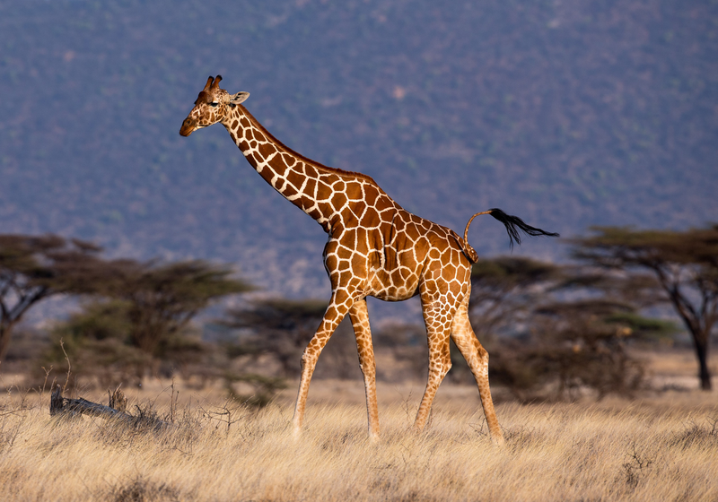

```{r setup, include=FALSE}
knitr::opts_chunk$set(echo = FALSE)
```

## Introduction

I am from Beijing, China.<br />  
I enrolled in the university of Nebraska Lincoln in 2018 Summer.<br />   
I am currently working on two master's degrees in Education and Statistics. 


## My favorite animal  



## My favorite graph from STAT-850


{width=80%}


## Nannan Wang CV

[Click this to view Nannan's CV](https://github.com/stat850-unl/11-presentation-zgbjunl/blob/master/NannanResume.pdf)


